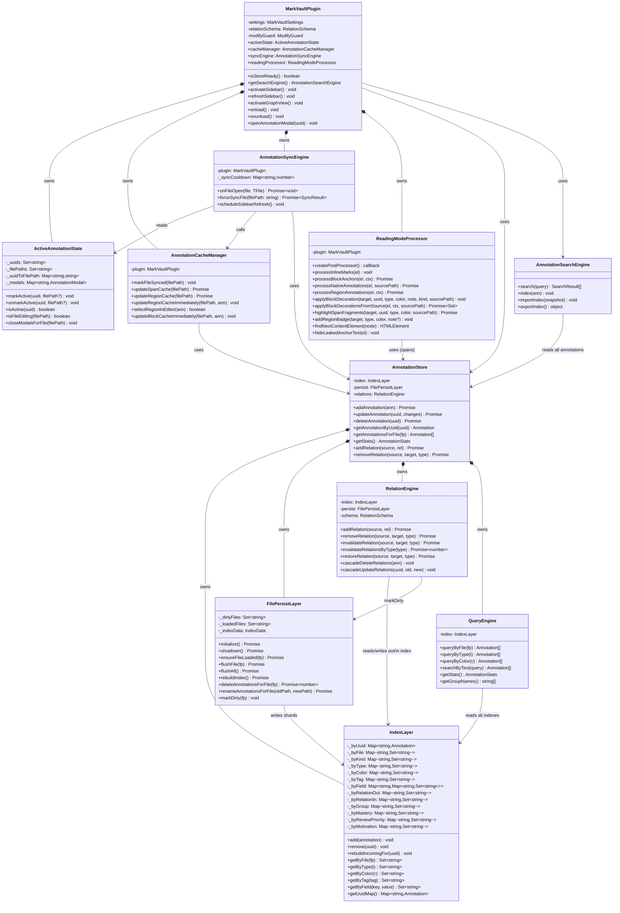

# P2-1/P2-2: 模块拆分设计文档 (Scheme A)

> **设计原则**: 按业务域功能模块切割，每模块独立文件+明确 API。只重构文件结构不改行为。
> **前置条件**: 24/24 测试全绿 + 生产构建通过
> **风险级别**: 🔴高 — 两个巨型文件被拆成 11 个子模块

---

## 1. 现状分析

### 1.1 main.ts (~3584 行) — 现状

| 区域 | 行号 | 行数 | `this.` 调用 | 关键依赖 |
|------|------|:--:|:--:|------|
| 字段声明 + 构造 | 51-99 | ~49 | — | settings, relationSchema, modifyGuard |
| Active State 管理 | 118-186 | ~68 | 15 | _activeAnnotation* (3 Set/Map) |
| Cache 管理 | 192-343 | ~151 | 4 | highlight-applier, annotationStore |
| `onload()` | 348-715 | ~367 | 53 | app.vault, registerView, registerEvent |
| `onunload()` | 717-730 | ~13 | 5 | _saveSearchIndex, modifyGuard |
| Search Index I/O | 737-768 | ~31 | 7 | _searchEngine, app.vault.adapter |
| Settings | 772-789 | ~17 | 6 | loadData, saveData, RelationSchema |
| Sidebar/GraphView 激活 | 792-857 | ~65 | 16 | app.workspace |
| `onFileOpen()` | 863-910 | ~47 | 10 | modifyGuard, _syncCooldown, settings |
| `forceSyncFile()` | 919-1173 | ~254 | 25 | app.vault, modifyGuard, annotationStore |
| `scheduleSidebarRefresh()` | 1176-1186 | ~10 | 4 | requestAnimationFrame |
| Offset Tracking | 1188-1234 | ~46 | 8 | activeFilePath, pendingChanges |
| **📦 Reading Processor** | **1236-2950** | **~1714** | **~80** | DOM API, app.vault (少量) |
| Annotation Modal | 2953-3057 | ~104 | 15 | app, AnnotationModal |
| Create Annotation | 3060-3252 | ~192 | 17 | app.vault, modifyGuard |
| Text Search Helpers | 3263-3584 | ~321 | 10 | 纯函数（可 static） |

### 1.2 annotation-store.ts (~2400 行) — 现状

| 区域 | 行号 | 行数 | 关键依赖 |
|------|------|:--:|------|
| 12 倒排索引声明 | 31-71 | ~40 | — |
| I/O 工具 | 87-130 | ~43 | DataAdapter, FileEncoder |
| `initialize()/shutdown()` | 147-365 | ~218 | 分片 JSON 读/写 |
| CRUD (add/update/delete) | 367-680 | ~313 | _addToIndex, _removeFromIndex |
| File Management | 717-1050 | ~333 | ensureFileLoaded, flushFile, rebuild |
| Tag Operations | 1070-1135 | ~65 | _addToIndex, _removeFromIndex |
| **Relation Engine** | **1138-1490** | **~352** | _byRelationOut, _cascadeDelete/Update |
| Flag & Group | 1493-1585 | ~92 | _addToIndex |
| Index Maintenance | 1602-1900 | ~298 | 12 索引 Map 直接读写 |
| Query Engine | 1900+ | ~400 | 12 索引 Map 只读查询 |

---

## 2. P2-1: main.ts 拆分方案

### 2.1 目标结构

```
src/
├── main.ts                          # MarkVaultPlugin (slim ~250 lines)
├── plugin/
│   ├── lifecycle.ts                 # onload/onunload 编排 + settings
│   ├── active-state.ts              # 活跃标注保护状态 (4 Set/Map)
│   ├── cache-manager.ts             # Span/Region/Block 缓存
│   ├── sync-engine.ts               # onFileOpen + forceSyncFile
│   └── reading-processor.ts         # 阅读模式渲染 (~1714 lines)
└── ui/
    ├── editor/
    │   └── context-menu.ts          # 已存在 (1101 lines)
    └── ...
```

### 2.2 各模块定义

#### 📦 `src/main.ts` — MarkVaultPlugin (保留)

```typescript
export default class MarkVaultPlugin extends Plugin {
  // ── 状态（所有子模块通过注入访问） ──
  settings: MarkVaultSettings;
  relationSchema: RelationSchema;
  readonly modifyGuard: ModifyGuard;
  readonly activeState: ActiveAnnotationState;      // ← 注入
  readonly cacheManager: AnnotationCacheManager;     // ← 注入
  readonly syncEngine: AnnotationSyncEngine;         // ← 注入
  readonly readingProcessor: ReadingModeProcessor;   // ← 注入

  // ── 公共访问器（子模块需要） ──
  isStoreReady(): boolean;
  getSearchEngine(): AnnotationSearchEngine;
  getRelationSchema(): RelationSchema;

  // ── 视图管理 ──
  activateSidebar();
  refreshSidebar();
  activateGraphView();
  refreshGraphView();

  // ── 生命周期 ──
  async onload();    // 委托给 LifecycleBootstrapper
  async onunload();
  async loadSettings();
  async saveSettings();
}
```

**保留在 main.ts 的方法**: ~15 个 (slim ~250 lines)

---

#### 📦 `src/plugin/active-state.ts` — ActiveAnnotationState

```typescript
export class ActiveAnnotationState {
  // 管理 4 个 Set/Map —— 当前已从 main.ts 提取方法
  _activeAnnotationUuids: Set<string>;
  _activeAnnotationFilePaths: Set<string>;
  _activeAnnotationUuidToFilePath: Map<string, string>;
  _activeAnnotationModals: Map<string, AnnotationModal>;

  markAnnotationActive(uuid: string, filePath?: string): void;
  unmarkAnnotationActive(uuid: string, filePath?: string): void;
  isAnnotationActive(uuid: string): boolean;
  isFileEditing(filePath: string): boolean;
  registerActiveAnnotationModal(uuid: string, modal: AnnotationModal): void;
  unregisterActiveAnnotationModal(uuid: string): void;
  closeActiveModalsForFile(filePath: string): void;
}
```

**提取行数**: ~68 lines (lines 118-186)

---

#### 📦 `src/plugin/cache-manager.ts` — AnnotationCacheManager

```typescript
export class AnnotationCacheManager {
  constructor(private plugin: MarkVaultPlugin) {}

  markFileSynced(filePath: string): void;
  async updateSpanCache(filePath: string): Promise<void>;
  async updateRegionCache(filePath: string): Promise<void>;
  updateRegionCacheImmediately(filePath: string, newAnnotation: Annotation): void;
  selectRegionInEditor(annotation: Annotation): boolean;
  updateBlockCacheImmediately(filePath: string, newAnnotation: Annotation): void;
}
```

**提取行数**: ~151 lines (lines 192-343)

**依赖**: `highlight-applier.ts` (import), `plugin.app.workspace`, `annotationStore`

---

#### 📦 `src/plugin/sync-engine.ts` — AnnotationSyncEngine

```typescript
export class AnnotationSyncEngine {
  private _syncCooldown: Map<string, number>;
  private _pendingSidebarRefresh: boolean;

  constructor(private plugin: MarkVaultPlugin) {}

  async onFileOpen(file: TFile): Promise<void>;     // ~47 lines
  async forceSyncFile(filePath: string): Promise<SyncResult>;  // ~254 lines
  scheduleSidebarRefresh(): void;                    // ~10 lines
}
```

**提取行数**: ~311 lines (lines 863-1186)

**依赖**: `plugin.modifyGuard`, `plugin.activeState`, `plugin.settings`, `plugin.cacheManager`, `annotationStore`, `syncFromMarkdown`, `batchRecoverOffsets`

---

#### 📦 `src/plugin/reading-processor.ts` — ReadingModeProcessor

```typescript
export class ReadingModeProcessor {
  constructor(private plugin: MarkVaultPlugin) {}

  // ── PostProcessor 入口 ──
  createMarkdownPostProcessor(): (el: HTMLElement, ctx: MarkdownPostProcessorContext) => Promise<void>;

  // ── <mark> 元素渲染 ──
  processInlineMarks(el: HTMLElement): void;

  // ── Block/Span 锚点渲染 ──
  async processBlockAnchors(el: HTMLElement, ctx: MarkdownPostProcessorContext): Promise<void>;
  async processNativeAnnotations(el: HTMLElement, sourcePath: string): Promise<void>;
  async processRegionAnnotations(el: HTMLElement, ctx: MarkdownPostProcessorContext): Promise<void>;

  // ── 装饰器方法 ──
  applyBlockDecoration(targetEl, uuid, type, color, note, anchorKind, sourcePath): void;
  async applyBlockDecorationsFromSource(el, ctx, sourcePath): Promise<Set<string>>;
  collectLeafBlocks(root: HTMLElement): HTMLElement[];
  computeBlockStarts(lines: string[], sectionStart: number, sectionEnd: number): number[];
  async highlightSpanFragments(targetEl, uuid, type, color, sourcePath): Promise<void>;

  // ── Region 专用 ──
  addRegionBadge(targetEl, type, color, note?): void;
  styleRegionBlockBorderAndText(el, uuid, type, color): void;
  wrapTextRange(root, startIdx, endIdx, uuid, type, color): HTMLElement;
  // ... 约 15 个 region 内部方法

  // ── DOM 工具 ──
  findNextContentElement(node: Node): HTMLElement | null;
  hideLeakedAnchorText(el: HTMLElement): void;
  isNodeBefore(a: Node, b: Node): boolean;
}
```

**提取行数**: ~1714 lines (lines 618-695 + 1236-2950)

**依赖**: `plugin.app.vault` (仅在 applyBlockDecorationsFromSource / processRegionAnnotations 中读取文件内容)

**⚠️ 关键发现**: Reading Processor 的方法主要是互相调用（`this.applyBlockDecoration`, `this.collectLeafBlocks` 等），外部依赖极少。提取后这些 `this` 变为模块内自引用，无需改动方法签名。

---

#### 保留在主文件的事件注册 (onload 内部)

以下代码段保留在 `main.ts` 的 `onload()` 中，因为它们是 Obsidian API 调用（`this.registerView`, `this.registerEvent`, `this.addRibbonIcon`），不适合提取：

- `registerView(MARKVAULT_SIDEBAR_VIEW_TYPE, ...)` — 约 10 行
- `registerView(MARKVAULT_GRAPH_VIEW_TYPE, ...)` — 约 10 行
- `addRibbonIcon(...)` ×2 — 约 10 行
- `registerCommands(this)` — 1 行
- `registerContextMenu(this)` — 1 行
- `addSettingTab(...)` — 1 行
- `this.registerEvent(workspace.on('file-open', ...))` — 约 20 行
- `this.registerEvent(vault.on('delete', ...))` — 约 40 行
- `this.registerEvent(vault.on('rename', ...))` — 约 50 行
- `this.registerEvent(workspace.on('active-leaf-change', ...))` — 约 30 行
- `this.registerMarkdownPostProcessor(...)` — 委托给 readingProcessor
- reading toolbar/click delegate 设置 — 约 30 行

**保留行数**: ~250 lines

---

### 2.3 合并后 main.ts 行数预估

| 来源 | 行数 |
|------|:--:|
| 导入 + 字段声明 | ~50 |
| Active State delegate | ~30 |
| Settings load/save | ~20 |
| Sidebar/GraphView 激活 | ~65 |
| onload 事件注册 | ~250 |
| onunload | ~15 |
| Search Index I/O | ~30 |
| Annotation Modal | ~100 |
| Create Annotation | ~190 |
| Text Search Helpers | ~320 |
| 空行 + 注释 | ~30 |
| **合计** | **~1100** |

> **结果**: main.ts 从 3584 → ~1100 行（减少 69%），5 个新模块从 0 加到 ~2500 行。

---

## 3. P2-2: annotation-store.ts 拆分方案

### 3.1 目标结构

```
src/db/
├── annotation-store.ts          # AnnotationStore (slim ~450 lines)
├── index-layer.ts               # IndexLayer — 12 倒排索引
├── persist-layer.ts             # FilePersistLayer — 分片 JSON I/O
├── relation-engine.ts           # RelationEngine — 关系 CRUD
├── index-maintenance.ts         # 索引维护 (_addToIndex/_removeFromIndex)
└── annotation-repo.ts           # 已存在 — 薄代理层
```

### 3.2 关键耦合分析

`updateAnnotation()` 是耦合最紧密的方法（见代码 397-474 行）：

```
updateAnnotation(uuid, changes)
  ├── _cascadeUpdateRelations()  // relation-engine
  ├── _removeFromIndex(uuid)     // index-maintenance
  ├── _byUuid.set()              // index-layer
  ├── _byFile 索引调整            // index-layer
  ├── ensureFileLoaded()         // persist-layer
  └── _addToIndex(newAnn)        // index-maintenance
```

**设计决策**: 将这 3 个操作（remove → merge → add）封装在 AnnotationStore 内部，子模块只提供原子操作，不管理事务边界。Store 是唯一的"编排者"。

### 3.3 各模块定义

#### 📦 `src/db/index-layer.ts` — IndexLayer

```typescript
export class IndexLayer {
  // 12 个倒排索引（保持 private → 通过 getter 只读暴露给 query-engine）
  readonly _byUuid: Map<string, Annotation>;
  readonly _byFile: Map<string, Set<string>>;
  readonly _byKind: Map<string, Set<string>>;
  readonly _byType: Map<string, Set<string>>;
  readonly _byColor: Map<string, Set<string>>;
  readonly _byTag: Map<string, Set<string>>;
  readonly _byField: Map<string, Map<string, Set<string>>>;
  readonly _byRelationOut: Map<string, Set<string>>;
  readonly _byRelationIn: Map<string, Set<string>>;
  readonly _byGroup: Map<string, Set<string>>;
  readonly _byMastery: Map<string, Set<string>>;
  readonly _byReviewPriority: Map<string, Set<string>>;
  readonly _byMotivation: Map<string, Set<string>>;

  // ── 原子索引操作 ──
  add(annotation: Annotation): void;    // _addToIndex 逻辑
  remove(uuid: string): void;           // _removeFromIndex 逻辑
  rebuildIncomingFor(uuid: string): void; // _rebuildIncomingIndexFor

  // ── 只读查询（供 query-engine 使用） ──
  getByFile(fp: string): Set<string> | undefined;
  getByType(t: string): Set<string> | undefined;
  getByColor(c: string): Set<string> | undefined;
  // ... 其余 getter
}
```

**提取行数**: ~338 lines (索引声明 + _addToIndex + _removeFromIndex + _rebuildIncomingIndexFor)

---

#### 📦 `src/db/persist-layer.ts` — FilePersistLayer

```typescript
export class FilePersistLayer {
  constructor(private baseDir: string, private adapter: DataAdapter) {}

  async initialize(): Promise<void>;
  async shutdown(): Promise<void>;
  async ensureFileLoaded(filePath: string): Promise<void>;
  async flushFile(filePath: string): Promise<void>;
  async flushAll(): Promise<void>;
  async rebuildIndex(): Promise<void>;
  async deleteAnnotationsForFile(filePath: string): Promise<number>;
  async renameAnnotationsForFile(oldPath: string, newPath: string): Promise<void>;

  // 内部状态
  _dirtyFiles: Set<string>;
  _loadedFiles: Set<string>;
  _indexData: IndexData;
  _indexDirty: boolean;
  _debounceTimers: Map<string, ReturnType<typeof setTimeout>>;
}
```

**提取行数**: ~550 lines (initialize/shutdown + file management + flush/rebuild + markDirty + scheduleFlush)

---

#### 📦 `src/db/relation-engine.ts` — RelationEngine

```typescript
export class RelationEngine {
  constructor(
    private index: IndexLayer,     // 读 _byRelationOut, _byRelationIn
    private persist: FilePersistLayer,  // markDirty + flush
    private schema: RelationSchema,
  ) {}

  async addRelation(sourceUuid: string, relation: AnnotationRelation): Promise<void>;
  async removeRelation(sourceUuid: string, targetUuid: string, type: RelationType): Promise<void>;
  async invalidateRelation(sourceUuid: string, targetUuid: string, type: RelationType): Promise<void>;
  async invalidateRelationsByType(type: RelationType): Promise<number>;
  async restoreRelation(sourceUuid: string, targetUuid: string, type: RelationType): Promise<void>;
  cascadeDeleteRelations(ann: Annotation): void;      // _cascadeDeleteRelations
  cascadeUpdateRelations(uuid: string, oldRels: AnnotationRelation[], newRels: AnnotationRelation[]): void;
  rebuildIncomingIndexFor(uuid: string): void;
}
```

**提取行数**: ~352 lines (lines 1138-1490)

---

#### 📦 `src/db/annotation-store.ts` — AnnotationStore (保留)

```typescript
export class AnnotationStore {
  // ── 子模块引用 ──
  private index: IndexLayer;
  private persist: FilePersistLayer;
  private relations: RelationEngine;
  private flags: FlagGroupManager;
  private query: QueryEngine;

  // ── 核心 CRUD（编排层） ──
  async initialize(): Promise<void> { /* 委托 persist + index */ }
  async shutdown(): Promise<void> { /* 委托 persist */ }
  async addAnnotation(annotation: Annotation): Promise<void> { /* index.add + persist.markDirty */ }
  async updateAnnotation(uuid: string, changes: Partial<Annotation>): Promise<void> { /* 编排层 */ }
  async deleteAnnotation(uuid: string): Promise<void> { /* index.remove + persist.markDirty */ }

  // ── Tag / Flag / Group（薄包装） ──
  async addTagToAnnotation(uuid, tag) { /* index.remove + merge + index.add */ }
  async updateFlags(uuid, changes) { /* index.remove + merge + index.add */ }
  async addGroupToAnnotation(uuid, group) { /* index.remove + merge + index.add */ }

  // ── 查询代理 ──
  getAnnotationByUuid(uuid): Annotation | undefined;  // → index._byUuid.get()
  getAnnotationsForFile(fp): Annotation[];             // → query
  getAllAnnotations(): Annotation[];                    // → index._byUuid.values()
  getStats(): AnnotationStats;                          // → query
  getGroupNames(): string[];                            // → query
  searchByText(query): Annotation[];                    // → query

  // ── Relation 代理 ──
  async addRelation(...) { return this.relations.addRelation(...); }
  async removeRelation(...) { return this.relations.removeRelation(...); }
  // ...
}
```

**保留行数**: ~450 lines

---

### 3.4 QueryEngine (内嵌于 IndexLayer 或独立模块)

QueryEngine 是纯只读的，可以从 IndexLayer 派生。方案：
- **嵌入 IndexLayer**: `index.queryByType(t)` — 简单但 IndexLayer 变大
- **独立模块**: `QueryEngine` 接收 IndexLayer 引用 — 更干净

**推荐**: 独立 `src/db/query-engine.ts`，构造函数接受 `IndexLayer` 引用。

---

## 4. 依赖注入方案

### 4.1 构造顺序 (main.ts `onload()` 中)

```typescript
// 1. 创建底层模块
const activeState = new ActiveAnnotationState();
const cacheManager = new AnnotationCacheManager(this);
const syncEngine = new AnnotationSyncEngine(this, activeState, cacheManager);
const readingProcessor = new ReadingModeProcessor(this);

// 2. 注入到 plugin
this.activeState = activeState;
this.cacheManager = cacheManager;
this.syncEngine = syncEngine;
this.readingProcessor = readingProcessor;
```

### 4.2 循环依赖检查

| A → B | 方向 | 是否循环 |
|-------|:--:|:--:|
| syncEngine → cacheManager | → | 否（单向） |
| syncEngine → activeState | → | 否（单向） |
| readingProcessor → plugin.app.vault | → | 否（Plugin 在构造时传入） |
| cacheManager → highlight-applier | → | 否（外部依赖） |
| IndexLayer → persist (markDirty) | → | ⚠️ 可能循环 |

**关于 IndexLayer ↔ PersistLayer**: `_addToIndex` 不调用 persist 方法，`_markDirty` 是 Store 层调用。所以拆分后 IndexLayer 和 PersistLayer 互相独立，Store 是唯一编排者。

---

## 5. Mermaid 类图



---

## 6. 迁移策略

### 6.1 执行顺序（P2-1 优先，P2-2 次之）

1. **P2-1a**: 提取 `ActiveAnnotationState` (最小风险，纯 Set/Map 操作，零外部依赖)
2. **P2-1b**: 提取 `AnnotationCacheManager` (中等风险，依赖 highlight-applier)
3. **P2-1c**: 提取 `AnnotationSyncEngine` (高风险，依赖前两步 + annotationStore)
4. **P2-1d**: 提取 `ReadingModeProcessor` (最大体积，但 self-contained)
5. **P2-2a**: 提取 `IndexLayer` (annotation-store 核心)
6. **P2-2b**: 提取 `FilePersistLayer`
7. **P2-2c**: 提取 `RelationEngine`
8. **P2-2d**: 提取 `QueryEngine`

### 6.2 验证门

每步完成后必须：
- `npx tsc --noEmit --skipLibCheck` ✅
- `node esbuild.config.mjs production` ✅
- `npm test` ✅ (全量 24+ 测试通过)
- 若失败立即回滚该步

### 6.3 一次性风险 vs 增量风险

| 策略 | 优势 | 劣势 |
|------|------|------|
| 逐文件提交 | 每步可回滚 | 8 次 commit |
| 一次全量 | 一条 commit | 失败难定位 |

**推荐**: 逐文件提交，每步独立 commit。

---

## 7. 风险矩阵

| 风险 | 概率 | 影响 | 缓解 |
|------|:--:|:--:|------|
| TS 编译失败（导入路径错误） | 中 | 🔴 | 每步验证 tsc |
| `this` 引用断裂（`this.app.workspace` 变为 `this.plugin.app.workspace`） | 高 | 🔴 | 逐方法 grep `this\.` 并替换 |
| 循环依赖（import A from B + import B from A） | 低 | 🔴 | 设计阶段已排除。运行时用动态 import 兜底 |
| 阅读模式渲染异常 | 中 | 🔴 | ReadingModeProcessor 是纯 DOM 操作，提取风险低 |
| 测试覆盖不足 | 低 | 🟡 | 已有 24 个测试，但要增加集成测试 |
| 同步引擎竞态 | 低 | 🔴 | sync-engine 逻辑不变，仅文件移动 |

---

## 8. 最终结构

```
src/
├── main.ts                              # ~1100 lines (↓ 69%)
├── plugin/
│   ├── active-state.ts                  # ~68 lines (new)
│   ├── cache-manager.ts                 # ~151 lines (new)
│   ├── sync-engine.ts                   # ~311 lines (new)
│   └── reading-processor.ts            # ~1714 lines (new)
├── db/
│   ├── annotation-store.ts             # ~450 lines (↓ 81%)
│   ├── index-layer.ts                  # ~338 lines (new)
│   ├── persist-layer.ts                # ~550 lines (new)
│   ├── relation-engine.ts              # ~352 lines (new)
│   ├── query-engine.ts                 # ~200 lines (new)
│   └── annotation-repo.ts              # unchanged
├── types/annotation.ts                  # unchanged
├── core/                                # unchanged
├── ui/                                  # unchanged (context-menu.ts already extracted)
├── search/                              # unchanged
└── utils/                               # unchanged
```

**净值**: 2 个巨型文件 (5984 行) → 1 个 slim 入口 (1100 行) + 9 个新模块 (3934 行) + 原有模块不变
