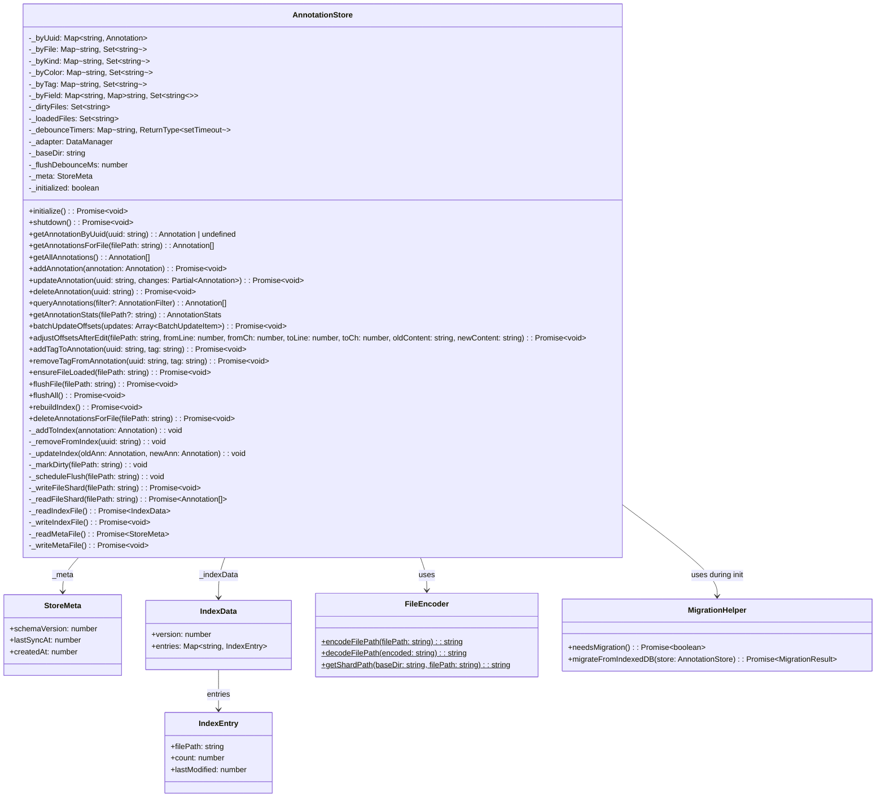
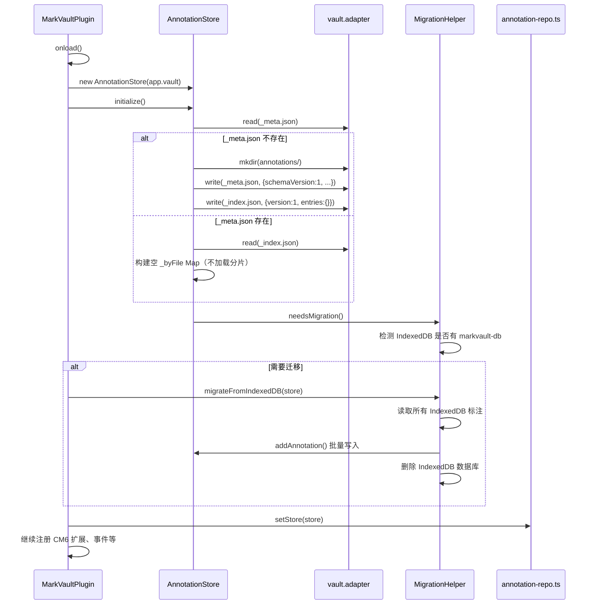
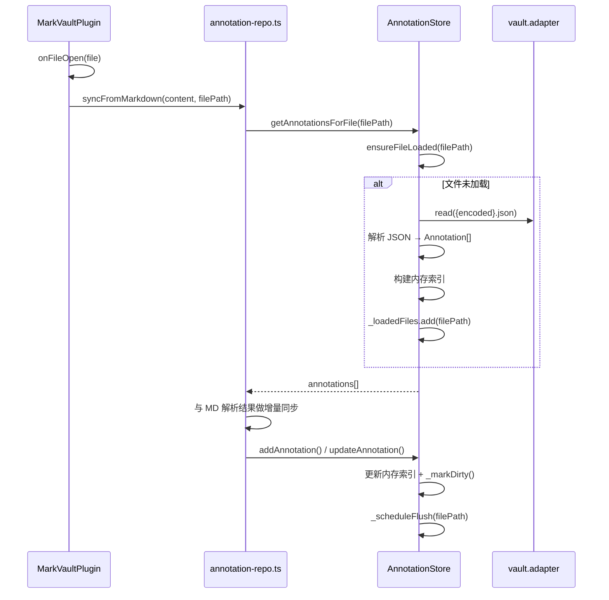
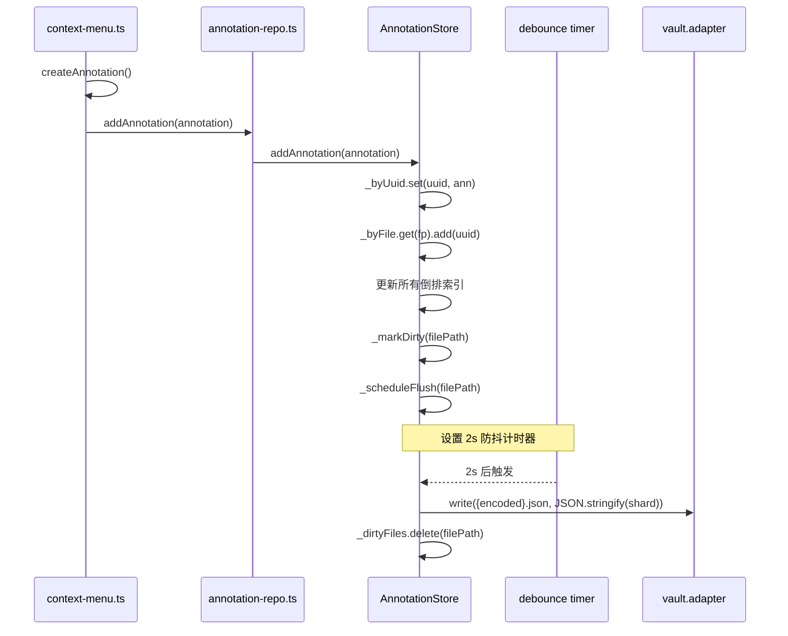
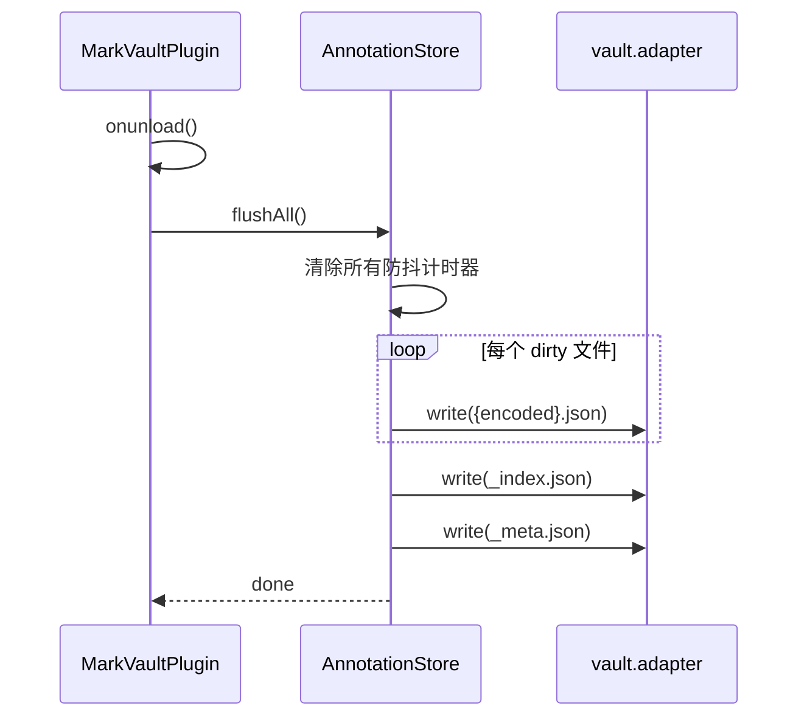
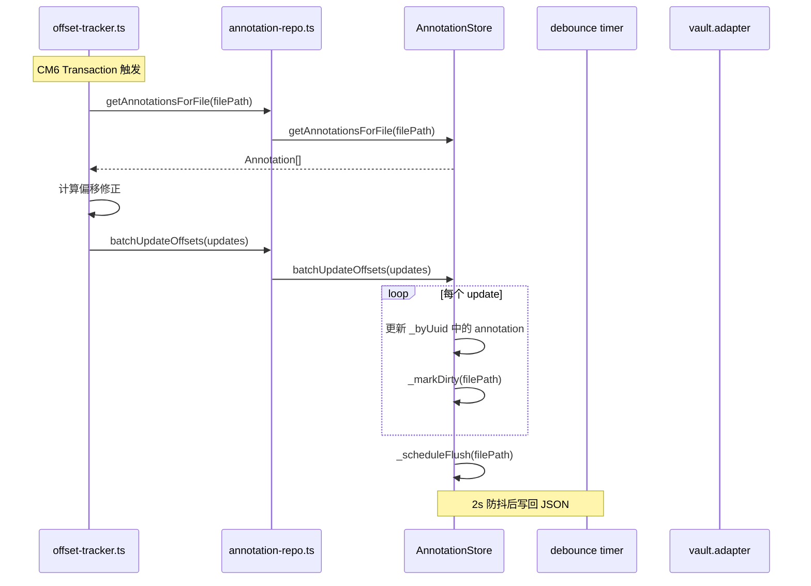
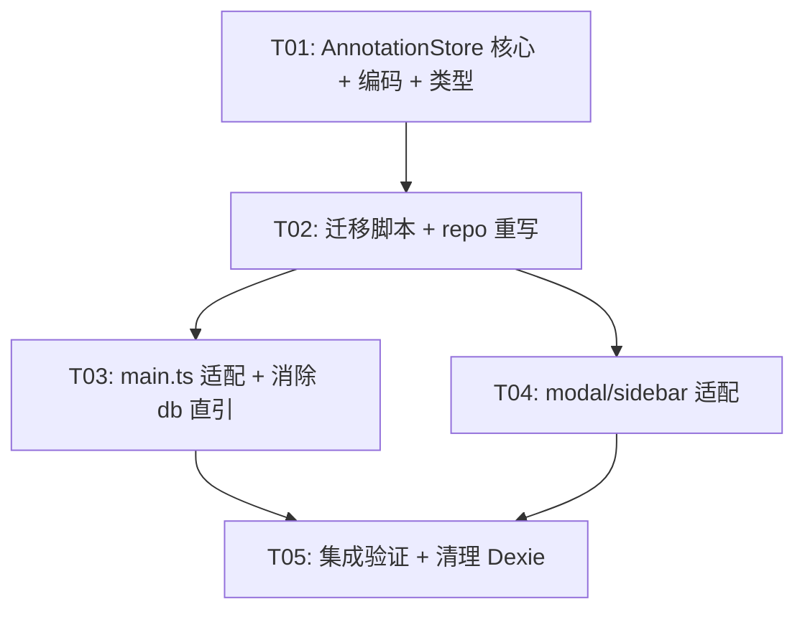

# MarkVault Phase 2: 分片 JSON + 内存索引 — 系统架构设计

> 作者：架构师高见远 | 版本：1.0 | 日期：2025-07-09

---

## 目录

1. [实现方案](#1-实现方案)
2. [文件清单](#2-文件清单)
3. [数据结构与接口](#3-数据结构与接口)
4. [程序调用流程](#4-程序调用流程)
5. [不明确事项](#5-不明确事项)
6. [所需包](#6-所需包)
7. [任务列表](#7-任务列表)
8. [共享知识](#8-共享知识)
9. [任务依赖图](#9-任务依赖图)

---

## 1. 实现方案

### 1.1 核心技术挑战

| 挑战 | 说明 | 方案 |
|------|------|------|
| **API 兼容性** | 7 个文件依赖 annotation-repo.ts 的函数签名 | 新 Store 类实现相同函数签名，annotation-repo.ts 变为薄代理层 |
| **IndexedDB 数据迁移** | 现有用户的 IndexedDB 数据需无损迁移到 JSON 分片 | 启动时检测 IndexedDB 是否有数据，有则自动迁移并删除 |
| **分片文件名编码** | filePath 可能含 `/`、`:`、空格等特殊字符 | Base64URL 编码，保留 `.json` 后缀 |
| **并发写安全** | 多处同时修改同一文件的标注需保证防抖不丢失 | per-file dirty 标记 + 防抖计时器，合并写回 |
| **崩溃恢复** | 插件崩溃时 dirty 数据未写回 JSON | Markdown 锚点作为 source of truth，重启后 syncFromMarkdown 自动修复 |
| **Dexie 直接引用** | markdown-sync.ts 和 offset-tracker.ts 绕过 repo 直接用 `db.annotations` | 新架构统一走 AnnotationStore，删除所有 Dexie 直引 |
| **flushAll 时序** | onunload 中必须同步写回，但 Obsidian 的 vault.adapter 是异步 API | onunload 中 await flushAll()，Obsidian 允许异步 onunload |

### 1.2 框架和库选型

| 库 | 版本 | 用途 | 选择理由 |
|-----|------|------|---------|
| **Obsidian API** | latest | 文件读写（vault.adapter） | 已有依赖，`this.app.vault.adapter.read/write` 支持插件目录内文件操作 |
| **Dexie** | 4.x | 迁移期兼容 + 最终删除 | 保留到迁移完成，之后从 dependencies 中移除 |

> **无需新增第三方依赖** — 分片 JSON 的读写完全基于 Obsidian 内置的 `vault.adapter` API（`read()`、`write()`、`mkdir()`、`remove()`），无需 fs 或其他库。

### 1.3 架构模式

```
┌──────────────────────────────────────────────┐
│                上层调用者                       │
│  main.ts / sidebar / modal / context-menu    │
│  markdown-sync / offset-tracker              │
└──────────────┬───────────────────────────────┘
               │ 调用 annotation-repo.ts 函数
               ▼
┌──────────────────────────────────────────────┐
│          annotation-repo.ts (薄代理层)          │
│   签名不变，内部转发到 AnnotationStore          │
└──────────────┬───────────────────────────────┘
               │ 委托
               ▼
┌──────────────────────────────────────────────┐
│           AnnotationStore (核心)               │
│  ┌─────────────┐  ┌──────────────────────┐   │
│  │ 内存索引层    │  │ 持久化调度层          │   │
│  │ 6 个 Map/Set │  │ dirty + 防抖 + flush │   │
│  └─────────────┘  └──────────────────────┘   │
└──────────────┬───────────────────────────────┘
               │ vault.adapter
               ▼
┌──────────────────────────────────────────────┐
│       .obsidian/plugins/obsidian-markvault/   │
│              annotations/                     │
│   _index.json  _meta.json  {file}.json       │
└──────────────────────────────────────────────┘
```

---

## 2. 文件清单

### 2.1 新增文件

| 文件路径 | 说明 |
|---------|------|
| `src/db/annotation-store.ts` | 核心存储类：内存索引 + 分片 JSON 读写 + dirty 管理 + 防抖写回 |
| `src/db/file-encoder.ts` | 文件名编码/解码工具（filePath ↔ 分片文件名） |
| `src/db/migration.ts` | IndexedDB → 分片 JSON 一次性迁移脚本 |

### 2.2 修改文件

| 文件路径 | 修改程度 | 说明 |
|---------|---------|------|
| `src/db/annotation-repo.ts` | **重写** | 从 Dexie 代理变为 AnnotationStore 代理，函数签名不变 |
| `src/db/database.ts` | **删除内容** | 清空实现，保留空文件给迁移期用，最终删除 |
| `src/main.ts` | **中改** | onload 中初始化 Store + 迁移；onunload 中 flushAll |
| `src/core/markdown-sync.ts` | **中改** | 消除 `db` 直引，统一走 repo 层 |
| `src/core/offset-tracker.ts` | **小改** | 消除 `db` 直引，改用 repo 函数 |
| `src/types/annotation.ts` | **小改** | 移除 `id?: number`（Dexie 自增主键），新增 Store 相关类型 |

### 2.3 不修改文件

| 文件路径 | 理由 |
|---------|------|
| `src/ui/editor/annotation-modal.ts` | 通过 repo 层间接使用，签名不变则无需改动 |
| `src/ui/editor/context-menu.ts` | 同上 |
| `src/ui/sidebar/AnnotationSidebar.ts` | 同上 |
| `src/core/highlight-applier.ts` | 不依赖 DB，纯 CM6 逻辑 |
| `src/core/offset-recovery.ts` | 纯函数，无 DB 依赖 |
| `src/core/md-context.ts` | 无 DB 依赖 |
| `src/core/annotation-parser.ts` | 无 DB 依赖 |
| `src/utils/*.ts` | 工具函数，无 DB 依赖 |
| `src/ui/settings/settings-tab.ts` | 无 DB 依赖 |

---

## 3. 数据结构与接口

### 3.1 核心类 — AnnotationStore



### 3.2 JSON Schema 规范

#### `_meta.json`

```json
{
  "$schema": "http://json-schema.org/draft-07/schema#",
  "type": "object",
  "properties": {
    "schemaVersion": { "type": "integer", "const": 1 },
    "createdAt": { "type": "number", "description": "Store 创建时间戳" },
    "lastSyncAt": { "type": "number", "description": "上次全量同步时间戳" }
  },
  "required": ["schemaVersion", "createdAt"]
}
```

示例：
```json
{
  "schemaVersion": 1,
  "createdAt": 1720500000000,
  "lastSyncAt": 1720510000000
}
```

#### `_index.json`

```json
{
  "$schema": "http://json-schema.org/draft-07/schema#",
  "type": "object",
  "properties": {
    "version": { "type": "integer" },
    "entries": {
      "type": "object",
      "additionalProperties": {
        "type": "object",
        "properties": {
          "filePath": { "type": "string", "description": "原始笔记路径" },
          "count": { "type": "integer", "description": "该文件的标注数" },
          "lastModified": { "type": "number", "description": "最后修改时间戳" }
        },
        "required": ["filePath", "count"]
      },
      "description": "key 为 Base64URL 编码的 filePath"
    }
  },
  "required": ["version", "entries"]
}
```

示例：
```json
{
  "version": 1,
  "entries": {
    "bm90ZXMvSGVsbG8gbQ": {
      "filePath": "notes/Hello.md",
      "count": 5,
      "lastModified": 1720510000000
    },
    "cHJvamVjdC9O": {
      "filePath": "project/计划书.md",
      "count": 3,
      "lastModified": 1720505000000
    }
  }
}
```

#### 单文件标注 JSON（`{encoded}.json`）

```json
{
  "$schema": "http://json-schema.org/draft-07/schema#",
  "type": "object",
  "properties": {
    "filePath": { "type": "string", "description": "笔记路径（冗余但方便校验）" },
    "annotations": {
      "type": "array",
      "items": { "$ref": "#/$defs/Annotation" }
    }
  },
  "required": ["filePath", "annotations"]
}
```

其中 `Annotation` 对象复用现有类型，但移除 `id` 字段（Dexie 自增主键不再需要）。

示例：
```json
{
  "filePath": "notes/Hello.md",
  "annotations": [
    {
      "uuid": "a1b2c3d4-...",
      "filePath": "notes/Hello.md",
      "kind": "inline",
      "type": "highlight",
      "color": "yellow",
      "text": "important text",
      "note": "this is important",
      "tags": ["review"],
      "fields": {},
      "startOffset": 42,
      "endOffset": 56,
      "startLine": 3,
      "endLine": 3,
      "contextBefore": "some context before",
      "contextAfter": "some context after",
      "createdAt": 1720500000000,
      "updatedAt": 1720505000000
    }
  ]
}
```

### 3.3 文件名编码规则

`filePath` → 分片文件名的映射在 `FileEncoder` 中实现：

```
输入: "notes/Hello.md"
步骤1: 提取笔记名部分（去掉 .md 后缀）: "notes/Hello"
步骤2: Base64URL 编码: "bm90ZXMvSGVsbG8"
步骤3: 拼接后缀: "bm90ZXMvSGVsbG8.json"
```

**编码规则**：
- 使用 `btoa(unescape(encodeURIComponent(filePath)))` 进行 Base64URL 编码
- 将 `+` → `-`，`/` → `_`，去掉 `=` 填充（Base64URL 标准）
- 这样做的好处：即使 filePath 含中文、空格、`:` 等特殊字符，编码后也是合法文件名
- `_index.json` 中的 entries key 也用同样的编码，value 中保留原始 filePath 便于调试

**解码规则**：
- 还原 Base64URL 填充（补 `=`）
- `_` → `/`，`-` → `+`
- `decodeURIComponent(escape(atob(decoded)))`

### 3.4 内存索引结构详细设计

```typescript
// 精确查找：O(1)
_byUuid: Map<string, Annotation>

// 按文件查找：O(1) → O(k) 遍历 Set
_byFile: Map<string, Set<string>>  // filePath → Set<uuid>

// 按标注类型查找
_byKind: Map<string, Set<string>>  // kind ("inline"/"block"/"span") → Set<uuid>

// 按颜色查找
_byColor: Map<string, Set<string>>  // color id → Set<uuid>

// 按标签查找：倒排索引
_byTag: Map<string, Set<string>>  // tag → Set<uuid>

// 按自定义字段查找：二级倒排索引
_byField: Map<string, Map<string, Set<string>>>  // fieldKey → (fieldValue → Set<uuid>)
```

**索引构建算法**：

启动时：
```
1. 读 _meta.json → 检查 schemaVersion
2. 读 _index.json → 获取所有文件路径列表
3. 对每个 filePath，不预加载分片（懒加载）
4. _byUuid 初始为空，_byFile 只建空 Set
```

懒加载（打开文件时）：
```
1. ensureFileLoaded(filePath)
2. 如果 _loadedFiles.has(filePath) → 已加载，直接返回
3. 读取 {encoded}.json → 解析得到 Annotation[]
4. 对每个 annotation：
   a. _byUuid.set(uuid, annotation)
   b. _byFile.get(filePath).add(uuid)
   c. _byKind.get(kind).add(uuid)
   d. _byColor.get(color).add(uuid)
   e. tags.forEach(tag => _byTag.get(tag).add(uuid))
   f. fields && Object.entries(fields).forEach(([k,v]) => _byField.get(k).get(v).add(uuid))
5. _loadedFiles.add(filePath)
```

增量更新（增删改时）：
```
addAnnotation(a):
  _byUuid.set(a.uuid, a)
  _byFile.get(a.filePath).add(a.uuid)
  _byKind.get(a.kind).add(a.uuid)
  _byColor.get(a.color).add(a.uuid)
  a.tags.forEach(t => addToTagIndex(t, a.uuid))
  a.fields && Object.entries(a.fields).forEach(([k,v]) => addToFieldIndex(k, v, a.uuid))
  _markDirty(a.filePath)

deleteAnnotation(uuid):
  const a = _byUuid.get(uuid)
  if (!a) return
  _byUuid.delete(uuid)
  _byFile.get(a.filePath)?.delete(uuid)
  _byKind.get(a.kind)?.delete(uuid)
  _byColor.get(a.color)?.delete(uuid)
  a.tags.forEach(t => _byTag.get(t)?.delete(uuid))
  a.fields && Object.entries(a.fields).forEach(([k,v]) => _byField.get(k)?.get(v)?.delete(uuid))
  _markDirty(a.filePath)

updateAnnotation(uuid, changes):
  const old = _byUuid.get(uuid)
  const merged = { ...old, ...changes, updatedAt: Date.now() }
  _removeFromIndex(uuid)  // 移除旧索引
  _byUuid.set(uuid, merged)
  _addToIndex(merged)     // 重建新索引
  _markDirty(merged.filePath)
```

### 3.5 Dirty 管理和防抖写回机制

```typescript
// dirty 文件集合
_dirtyFiles: Set<string>

// 每文件独立的防抖计时器
_debounceTimers: Map<string, ReturnType<typeof setTimeout>>

// 防抖延迟
_flushDebounceMs: number = 2000  // 2秒

_markDirty(filePath: string): void {
  this._dirtyFiles.add(filePath)
  this._scheduleFlush(filePath)
}

_scheduleFlush(filePath: string): void {
  // 清除已有的计时器
  const existing = this._debounceTimers.get(filePath)
  if (existing) clearTimeout(existing)
  
  // 设置新的防抖计时器
  const timer = setTimeout(async () => {
    await this._writeFileShard(filePath)
    this._dirtyFiles.delete(filePath)
    this._debounceTimers.delete(filePath)
  }, this._flushDebounceMs)
  
  this._debounceTimers.set(filePath, timer)
}

// 强制写回单个文件
async flushFile(filePath: string): Promise<void> {
  const timer = this._debounceTimers.get(filePath)
  if (timer) {
    clearTimeout(timer)
    this._debounceTimers.delete(filePath)
  }
  if (this._dirtyFiles.has(filePath)) {
    await this._writeFileShard(filePath)
    this._dirtyFiles.delete(filePath)
  }
}

// 写回所有 dirty 数据（onunload 时调用）
async flushAll(): Promise<void> {
  // 清除所有防抖计时器
  for (const [_, timer] of this._debounceTimers) {
    clearTimeout(timer)
  }
  this._debounceTimers.clear()
  
  // 写回所有 dirty 文件
  const dirtyPaths = [...this._dirtyFiles]
  for (const filePath of dirtyPaths) {
    try {
      await this._writeFileShard(filePath)
    } catch (err) {
      console.error(`MarkVault: flushAll failed for ${filePath}`, err)
    }
  }
  this._dirtyFiles.clear()
  
  // 更新 _index.json（包含最新的 count 信息）
  await this._writeIndexFile()
  
  // 更新 _meta.json
  this._meta.lastSyncAt = Date.now()
  await this._writeMetaFile()
}
```

### 3.6 分片文件读写

```typescript
async _writeFileShard(filePath: string): Promise<void> {
  const uuids = this._byFile.get(filePath)
  if (!uuids) return
  
  const annotations: Annotation[] = []
  for (const uuid of uuids) {
    const ann = this._byUuid.get(uuid)
    if (ann) annotations.push(ann)
  }
  
  const shardData = {
    filePath,
    annotations: annotations.map(a => {
      // 移除 id 字段（Dexie 遗留）
      const { id, ...rest } = a as any
      return rest
    })
  }
  
  const encoded = FileEncoder.encodeFilePath(filePath)
  const shardPath = `${this._baseDir}/annotations/${encoded}.json`
  const content = JSON.stringify(shardData, null, 2)
  
  await this._adapter.write(shardPath, content)
}

async _readFileShard(filePath: string): Promise<Annotation[]> {
  const encoded = FileEncoder.encodeFilePath(filePath)
  const shardPath = `${this._baseDir}/annotations/${encoded}.json`
  
  try {
    const content = await this._adapter.read(shardPath)
    const data = JSON.parse(content)
    return data.annotations || []
  } catch {
    return []
  }
}
```

---

## 4. 程序调用流程

### 4.1 插件启动流程



### 4.2 文件打开流程（懒加载）



### 4.3 标注创建流程



### 4.4 插件卸载流程



### 4.5 偏移修正流程（重点：消除 db 直引）



---

## 5. 不明确事项

| # | 事项 | 假设 | 备注 |
|---|------|------|------|
| 1 | Obsidian `vault.adapter` 在 onunload 中是否能可靠写入 | 是 — Obsidian 的 onunload 支持 async，adapter 在插件卸载期间仍可用 | 需实测确认 |
| 2 | `_index.json` 的更新频率 | 只在 flushAll 时更新（非高频） | 如果 index 数据量很大，可考虑增量更新 |
| 3 | 分片文件删除时机 | 当文件标注数为 0 时，删除分片文件 + 从 _index.json 移除 entry | 避免残留空文件 |
| 4 | 旧版本 `id` 字段的处理 | 迁移时从 Annotation 对象中移除 `id` 字段 | 新架构不再需要 |
| 5 | 并发安全：用户快速切换文件 | 每个文件的 dirty 标记独立，防抖计时器独立 | 不会交叉影响 |
| 6 | Obsidian Sync / Git 对 annotations/ 目录的影响 | annotations/ 在 .obsidian/plugins/ 下，Obsidian Sync 默认同步插件数据 | 可能需要文档说明 |
| 7 | `Annotation.id` (Dexie 自增) 是否有外部引用 | 仅有 annotation-repo.ts 内部的 `getAnnotationById` 使用 | 新架构移除此函数 |

---

## 6. 所需包

```
- dexie@^4.0.10: 仅迁移期保留，迁移完成后移除
```

> **无新增依赖** — 所有核心功能基于 Obsidian 内置 API。

---

## 7. 任务列表

### T01: 项目基础设施 — AnnotationStore 核心 + 编码工具 + 类型更新

| 项 | 值 |
|----|-----|
| **Task ID** | T01 |
| **Task Name** | AnnotationStore 核心类 + 文件编码 + 类型更新 |
| **Source Files** | `src/db/annotation-store.ts`(新), `src/db/file-encoder.ts`(新), `src/types/annotation.ts`(改), `src/db/database.ts`(清空) |
| **Dependencies** | 无 |
| **Priority** | P0 |

**输入**：当前 Annotation 类型定义、目标架构规范

**输出**：
1. `AnnotationStore` 类完整实现：
   - 6 个内存索引 Map/Set
   - `initialize()` / `shutdown()` 生命周期
   - 完整 CRUD 方法（add/get/update/delete/query/stats）
   - dirty 管理 + 防抖写回 + flushAll
   - 分片 JSON 读写
   - `_index.json` 和 `_meta.json` 读写
   - `ensureFileLoaded()` 懒加载
2. `FileEncoder` 类：Base64URL 编码/解码
3. `annotation.ts` 类型更新：移除 `id?: number`，新增 `StoreMeta`/`IndexData`/`IndexEntry`/`AnnotationStats`/`BatchUpdateItem` 类型
4. `database.ts` 清空为空文件（不删文件避免编译错误）

**详细修改**：

**`src/types/annotation.ts`**：
- 移除 `id?: number` 字段
- 新增：
  ```typescript
  export interface StoreMeta {
    schemaVersion: number;
    createdAt: number;
    lastSyncAt: number;
  }

  export interface IndexEntry {
    filePath: string;
    count: number;
    lastModified?: number;
  }

  export interface IndexData {
    version: number;
    entries: Record<string, IndexEntry>;  // key = Base64URL(filePath)
  }

  export interface AnnotationStats {
    total: number;
    byType: Record<string, number>;
    byColor: Record<string, number>;
    withNotes: number;
    withTags: number;
  }

  export interface BatchUpdateItem {
    uuid: string;
    startOffset: number;
    endOffset: number;
    spanRanges?: SpanRange[];
  }
  ```

**`src/db/database.ts`**：
- 清空实现，保留空 export（避免其他文件 import 报错）
  ```typescript
  // Phase 2: Dexie has been replaced by AnnotationStore.
  // This file is kept as a stub during migration.
  // TODO: Remove this file after migration is complete.
  ```

---

### T02: 迁移脚本 + annotation-repo.ts 重写

| 项 | 值 |
|----|-----|
| **Task ID** | T02 |
| **Task Name** | IndexedDB 迁移脚本 + repo 层代理重写 |
| **Source Files** | `src/db/migration.ts`(新), `src/db/annotation-repo.ts`(重写) |
| **Dependencies** | T01 |
| **Priority** | P0 |

**输入**：T01 的 AnnotationStore 类

**输出**：
1. `MigrationHelper` 类：
   - `needsMigration()`: 检测 IndexedDB 中是否有 `markvault-db`
   - `migrateFromIndexedDB(store)`: 读取所有标注，批量写入 Store，删除 IndexedDB
   - 错误处理：迁移失败时保留 IndexedDB 数据，下次启动可重试
2. `annotation-repo.ts` 重写为 AnnotationStore 的薄代理层：
   - 全局 `_store: AnnotationStore | null` 变量
   - `initDB()` → `_store.initialize()`
   - `getAnnotationsForFile()` → `_store.getAnnotationsForFile()`
   - `getAllAnnotations()` → `_store.getAllAnnotations()`
   - `getAnnotationByUuid()` → `_store.getAnnotationByUuid()`
   - `addAnnotation()` → `_store.addAnnotation()`
   - `updateAnnotation()` → `_store.updateAnnotation()`
   - `deleteAnnotation()` → `_store.deleteAnnotation()`
   - `queryAnnotations()` → `_store.queryAnnotations()`
   - `getAnnotationStats()` → `_store.getAnnotationStats()`
   - `batchUpdateOffsets()` → `_store.batchUpdateOffsets()`
   - 新增 `getStore()` / `setStore()` 函数
   - 移除 `getAnnotationById()` — 新架构不再有数字 id
   - 移除 `deleteAnnotationsForFile()` — 暂时保留为 Store 方法但 repo 层不暴露

**详细修改**：

**`src/db/annotation-repo.ts`** — 完全重写：

```typescript
import type { Annotation, AnnotationFilter, AnnotationStats, BatchUpdateItem } from '../types/annotation';
import type { AnnotationStore } from './annotation-store';

let _store: AnnotationStore | null = null;

export function setStore(store: AnnotationStore): void {
  _store = store;
}

export function getStore(): AnnotationStore {
  if (!_store) throw new Error('AnnotationStore not initialized');
  return _store;
}

// ─── 初始化 ─────────────────────────────────────────

export async function initDB(): Promise<void> {
  if (!_store) throw new Error('AnnotationStore not set');
  await _store.initialize();
}

// ─── CRUD ──────────────────────────────────────────────

export async function addAnnotation(annotation: Annotation): Promise<void> {
  await getStore().addAnnotation(annotation);
}

export async function getAnnotationByUuid(uuid: string): Promise<Annotation | undefined> {
  return getStore().getAnnotationByUuid(uuid);
}

export async function updateAnnotation(uuid: string, changes: Partial<Annotation>): Promise<void> {
  await getStore().updateAnnotation(uuid, changes);
}

export async function deleteAnnotation(uuid: string): Promise<void> {
  await getStore().deleteAnnotation(uuid);
}

// ─── 批量查询 ─────────────────────────────────────────

export async function getAnnotationsForFile(filePath: string): Promise<Annotation[]> {
  await getStore().ensureFileLoaded(filePath);
  return getStore().getAnnotationsForFile(filePath);
}

export async function getAllAnnotations(): Promise<Annotation[]> {
  return getStore().getAllAnnotations();
}

// ─── 过滤查询 ─────────────────────────────────────────

export async function queryAnnotations(filter?: AnnotationFilter): Promise<Annotation[]> {
  return getStore().queryAnnotations(filter);
}

// ─── 统计 ─────────────────────────────────────────────

export async function getAnnotationStats(filePath?: string): Promise<AnnotationStats> {
  return getStore().getAnnotationStats(filePath);
}

// ─── 偏移修正 ─────────────────────────────────────────

export async function batchUpdateOffsets(updates: BatchUpdateItem[]): Promise<void> {
  await getStore().batchUpdateOffsets(updates);
}

export async function adjustOffsetsAfterEdit(
  filePath: string,
  fromLine: number, fromCh: number,
  toLine: number, toCh: number,
  oldContent: string, newContent: string,
): Promise<void> {
  await getStore().adjustOffsetsAfterEdit(filePath, fromLine, fromCh, toLine, toCh, oldContent, newContent);
}

export async function addTagToAnnotation(uuid: string, tag: string): Promise<void> {
  await getStore().addTagToAnnotation(uuid, tag);
}

export async function removeTagFromAnnotation(uuid: string, tag: string): Promise<void> {
  await getStore().removeTagFromAnnotation(uuid, tag);
}
```

**`src/db/migration.ts`** — 新建：

```typescript
import { db } from './database';
import type { Annotation } from '../types/annotation';
import type { AnnotationStore } from './annotation-store';

export interface MigrationResult {
  migrated: number;
  errors: number;
}

export async function needsMigration(): Promise<boolean> {
  try {
    // 尝试打开 IndexedDB 并检查是否有数据
    const count = await db.annotations.count();
    return count > 0;
  } catch {
    return false;
  }
}

export async function migrateFromIndexedDB(store: AnnotationStore): Promise<MigrationResult> {
  let migrated = 0;
  let errors = 0;

  try {
    const allAnnotations = await db.annotations.toArray();

    // 按 filePath 分组
    const byFile = new Map<string, Annotation[]>();
    for (const ann of allAnnotations) {
      const list = byFile.get(ann.filePath) || [];
      list.push(ann);
      byFile.set(ann.filePath, list);
    }

    // 逐文件写入 Store
    for (const [filePath, annotations] of byFile) {
      try {
        for (const ann of annotations) {
          // 移除 Dexie 的 id 字段
          const { id, ...cleanAnn } = ann as any;
          await store.addAnnotation(cleanAnn);
          migrated++;
        }
        // 立即写回分片
        await store.flushFile(filePath);
      } catch (err) {
        console.error(`MarkVault migration: failed for ${filePath}`, err);
        errors += annotations.length;
      }
    }

    // 迁移成功，删除 IndexedDB
    if (errors === 0) {
      await db.delete();
      console.log('MarkVault migration: IndexedDB deleted successfully');
    }
  } catch (err) {
    console.error('MarkVault migration: fatal error', err);
    errors += migrated > 0 ? 1 : 0;  // 标记有错误
  }

  return { migrated, errors };
}
```

---

### T03: main.ts 适配 + 消除 Dexie 直引

| 项 | 值 |
|----|-----|
| **Task ID** | T03 |
| **Task Name** | main.ts 生命周期适配 + markdown-sync / offset-tracker 去除 db 直引 |
| **Source Files** | `src/main.ts`(改), `src/core/markdown-sync.ts`(改), `src/core/offset-tracker.ts`(改) |
| **Dependencies** | T02 |
| **Priority** | P0 |

**输入**：T02 的 annotation-repo 代理层 + MigrationHelper

**输出**：
1. `main.ts`：
   - `onload()` 中创建 `AnnotationStore` 实例 → `setStore()` → `initDB()` → 迁移
   - `onunload()` 中调用 `store.flushAll()`
   - `rebuildDatabase()` 改用 Store 的 `rebuildIndex()`
   - 移除 `import { db } from './db/database'` 等直引
2. `markdown-sync.ts`：
   - 移除 `import { db, toPlain } from '../db/database'`
   - 所有 `db.annotations.where('uuid').equals(x).modify(y)` 替换为 `updateAnnotation(x, y)`
   - 所有 `db.annotations.where('uuid').equals(x).first()` 替换为 `getAnnotationByUuid(x)`
   - 保留 `toPlain` 逻辑但内联实现（structuredClone / JSON.parse(JSON.stringify)）
3. `offset-tracker.ts`：
   - 移除 `import { db } from '../db/database'`
   - `applyIncrementalOffsetFix()` 中的 `db.transaction('rw', db.annotations, ...)` 替换为 repo 层调用：
     - 批量删除 → 循环调用 `deleteAnnotation(uuid)`
     - 批量更新 → 调用 `batchUpdateOffsets(updates)`

**详细修改**：

**`src/main.ts`** 关键改动点：

```typescript
// 新增 import
import { AnnotationStore } from './db/annotation-store';
import { setStore, getStore } from './db/annotation-repo';
import { needsMigration, migrateFromIndexedDB } from './db/migration';

// onload() 开头新增
async onload() {
  // ── 数据层初始化（最优先） ──
  const store = new AnnotationStore(this.app.vault);
  setStore(store);
  await initDB();

  // 迁移检测
  if (await needsMigration()) {
    console.log('MarkVault: migrating from IndexedDB to JSON shards...');
    const result = await migrateFromIndexedDB(store);
    console.log(`MarkVault: migration complete — migrated: ${result.migrated}, errors: ${result.errors}`);
  }
  
  // ... 原有逻辑不变 ...
}

// onunload() 改动
async onunload() {
  console.log('MarkVault: unloading plugin');
  await getStore().flushAll();
}

// rebuildDatabase() 改动
async rebuildDatabase() {
  console.log('MarkVault: rebuilding store...');
  try {
    await getStore().rebuildIndex();
    console.log('MarkVault: store rebuilt');
    await this.refreshSidebar();
  } catch (err) {
    console.error('MarkVault: rebuild store error', err);
  }
}
```

**`src/core/markdown-sync.ts`** 关键改动点：

- 删除 `import { db, toPlain } from '../db/database';`
- 新增 `import { updateAnnotation, getAnnotationByUuid, addAnnotation, getAnnotationsForFile } from '../db/annotation-repo';`
- `syncFromMarkdown()` 中：
  - `toPlain({...ann, ...})` → `structuredClone({...ann, ...})` 或 `JSON.parse(JSON.stringify({...ann, ...}))`
  - `await addAnnotation(annotationToAdd)` — 已走 repo 层
  - `await db.annotations.where('uuid').equals(mdAnn.uuid).modify(updates)` → `await updateAnnotation(mdAnn.uuid, updates)`
- `migrateLegacyAnchors()` 中：
  - `await db.annotations.where('uuid').equals(anchor.uuid).first()` → `await getAnnotationByUuid(anchor.uuid)`
  - `await db.annotations.where('uuid').equals(anchor.uuid).modify({ note: anchor.note })` → `await updateAnnotation(anchor.uuid, { note: anchor.note })`
  - 其他 `db.annotations.where().modify()` 同理替换

**`src/core/offset-tracker.ts`** 关键改动点：

- 删除 `import { db } from '../db/database';`
- 新增 `import { deleteAnnotation, batchUpdateOffsets } from '../db/annotation-repo';`
- `applyIncrementalOffsetFix()` 中的数据库写入部分：
  ```typescript
  // 旧代码：
  // await db.transaction('rw', db.annotations, async () => {
  //   for (const uuid of toDelete) {
  //     await db.annotations.where('uuid').equals(uuid).delete();
  //   }
  //   for (const u of toUpdate) {
  //     await db.annotations.where('uuid').equals(u.uuid).modify(updates);
  //   }
  // });

  // 新代码：
  for (const uuid of toDelete) {
    await deleteAnnotation(uuid);
    deletedCount++;
  }
  if (toUpdate.length > 0) {
    await batchUpdateOffsets(toUpdate);
    updatedCount = toUpdate.length;
  }
  ```

---

### T04: annotation-modal.ts 适配 + 侧边栏适配

| 项 | 值 |
|----|-----|
| **Task ID** | T04 |
| **Task Name** | annotation-modal 和 sidebar 去除 db 直引 |
| **Source Files** | `src/ui/editor/annotation-modal.ts`(改), `src/ui/sidebar/AnnotationSidebar.ts`(改，极小改) |
| **Dependencies** | T02 |
| **Priority** | P1 |

**输入**：T02 的 repo 代理层

**输出**：

**`src/ui/editor/annotation-modal.ts`** 关键改动点：

- 删除 `import { db } from '../../db/database';`
- `save()` 方法中的回滚逻辑：
  ```typescript
  // 旧代码（回滚 DB）：
  // await db.annotations.where('uuid').equals(this.annotation.uuid).modify({
  //   ...rollbackUpdates,
  //   updatedAt: this.annotation.updatedAt,
  // });

  // 新代码：
  await updateAnnotation(this.annotation.uuid, {
    ...rollbackUpdates,
    updatedAt: this.annotation.updatedAt,
  });
  ```

**`src/ui/sidebar/AnnotationSidebar.ts`**：
- 实际上该文件已经完全通过 repo 层调用，无 db 直引
- 只需确认 import 列表正确（移除可能残留的 `database` 引用）
- **预计无需改动**，仅需验证

---

### T05: 集成测试 + 清理

| 项 | 值 |
|----|-----|
| **Task ID** | T05 |
| **Task Name** | 集成验证 + 删除 Dexie 依赖 + 最终清理 |
| **Source Files** | `package.json`(改), `src/db/database.ts`(删), 全局验证 |
| **Dependencies** | T03, T04 |
| **Priority** | P1 |

**输入**：T03 + T04 的完整实现

**输出**：
1. 全局搜索确认无 `db.annotations` / `from 'dexie'` / `import.*database` 残留引用
2. 从 `package.json` 移除 `dexie` 依赖
3. 删除 `src/db/database.ts` 文件
4. 验证场景清单：
   - [ ] 新安装：annotations/ 目录自动创建
   - [ ] 从 IndexedDB 迁移：数据无损，迁移后 IndexedDB 被删除
   - [ ] 创建标注：分片 JSON 文件自动生成
   - [ ] 编辑标注：内存更新 + 防抖写回
   - [ ] 删除标注：分片 JSON 更新，0 标注时删除文件
   - [ ] 快速连续修改：防抖合并，最终一致
   - [ ] 插件卸载：flushAll 正确写回
   - [ ] 崩溃恢复：重启后 syncFromMarkdown 自动修复
   - [ ] 侧边栏查询：内存索引正确
   - [ ] 全量统计：getAllAnnotations 遍历所有已加载分片

---

## 8. 共享知识

```
- 所有 Annotation 对象以 uuid 为主键，不再有数字 id
- 分片 JSON 存储路径: .obsidian/plugins/obsidian-markvault/annotations/
- 文件名编码: Base64URL (filePath) → {encoded}.json
- _index.json 是全局索引，在 flushAll 时更新
- 内存索引在 ensureFileLoaded() 时按需构建
- 所有 repo 层函数保持 async 签名（即使 Store 方法是同步的），确保 API 兼容
- Markdown 是 source of truth — syncFromMarkdown 用于崩溃恢复
- 分片文件在标注数为 0 时删除
- addAnnotation 不再返回 number（旧版返回 Dexie 自增 id），改为返回 void
- updateAnnotation 不再返回 number（旧版返回 modify count），改为返回 void
- getAnnotationById(id: number) 被移除 — 新架构无数字 id
- deleteAnnotationsForFile 保留为 Store 内部方法，repo 层暂不暴露
- 防抖写回延迟: 2000ms
- flushAll() 在 onunload 中调用，确保所有 dirty 数据写回
```

---

## 9. 任务依赖图



**关键路径**：T01 → T02 → T03 → T05

---

## 附录 A: 逐文件修改清单

### `src/types/annotation.ts`

| 修改点 | 修改前 | 修改后 |
|--------|--------|--------|
| Annotation 接口 | `id?: number;` | 删除此行 |
| 新增类型 | 无 | 添加 `StoreMeta`, `IndexEntry`, `IndexData`, `AnnotationStats`, `BatchUpdateItem` |

### `src/db/database.ts`

| 修改点 | 修改前 | 修改后 |
|--------|--------|--------|
| 整个文件 | MarkVaultDB 类、getDB()、db Proxy、toPlain() | 仅保留注释说明文件已废弃（T01），最终删除（T05） |

### `src/db/annotation-repo.ts`

| 修改点 | 修改前 | 修改后 |
|--------|--------|--------|
| 全部 | 基于 Dexie db 对象的函数实现 | 基于 AnnotationStore 的代理函数 |
| `addAnnotation` 返回值 | `Promise<number>` (Dexie id) | `Promise<void>` |
| `updateAnnotation` 返回值 | `Promise<number>` | `Promise<void>` |
| 删除 `getAnnotationById` | 存在 | 删除 |
| 删除 `deleteAnnotationsForFile` | 存在 | 暂不暴露 |
| 新增 `setStore` / `getStore` | 无 | 新增 |

### `src/main.ts`

| 修改点 | 修改前 | 修改后 |
|--------|--------|--------|
| import | 无 Store 相关 | 新增 `AnnotationStore`, `setStore`, `getStore`, 迁移相关 |
| `onload()` | 无 Store 初始化 | 新增 Store 创建 + setStore + initDB + 迁移 |
| `onunload()` | 仅 log | 新增 `await getStore().flushAll()` |
| `rebuildDatabase()` | Dexie 重建 | `store.rebuildIndex()` |

### `src/core/markdown-sync.ts`

| 修改点 | 修改前 | 修改后 |
|--------|--------|--------|
| import | `import { db, toPlain } from '../db/database'` | 删除 db，toPlain 内联 |
| `db.annotations.where().modify()` | 多处直引 | 改用 `updateAnnotation()` |
| `db.annotations.where().first()` | 2 处直引 | 改用 `getAnnotationByUuid()` |

### `src/core/offset-tracker.ts`

| 修改点 | 修改前 | 修改后 |
|--------|--------|--------|
| import | `import { db } from '../db/database'` | 删除，新增 repo 层 import |
| `db.transaction('rw', ...)` | 1 处事务 | 拆为 `deleteAnnotation` + `batchUpdateOffsets` |

### `src/ui/editor/annotation-modal.ts`

| 修改点 | 修改前 | 修改后 |
|--------|--------|--------|
| import | `import { db } from '../../db/database'` | 删除 |
| 回滚 DB | `db.annotations.where().modify()` | `updateAnnotation()` |

---

## 附录 B: 风险点

### B.1 数据丢失风险

| 风险 | 等级 | 缓解措施 |
|------|------|---------|
| 迁移过程中断 | **高** | 迁移失败时保留 IndexedDB 数据，下次启动可重试；迁移成功后才删除 |
| flushAll 在 onunload 中失败 | **中** | Markdown 锚点是 source of truth，重启后 syncFromMarkdown 自动修复 |
| JSON 文件损坏 | **低** | 每个文件独立分片，损坏只影响单文件；可从 Markdown 重建 |

### B.2 性能回退风险

| 风险 | 等级 | 缓解措施 |
|------|------|---------|
| 首次 getAllAnnotations 需加载全部分片 | **中** | 大部分场景用 getAnnotationsForFile（只加载单文件）；全局搜索/统计按需加载 |
| 内存占用增加 | **低** | 典型用户 < 1000 标注，每个约 500B，总计 < 500KB；懒加载进一步控制 |
| 文件写入延迟（2s 防抖） | **低** | 内存索引即时更新，UI 响应无延迟；2s 后异步写回不影响交互 |

### B.3 迁移中断风险

| 风险 | 等级 | 缓解措施 |
|------|------|---------|
| 迁移中途 Obsidian 崩溃 | **中** | 下次启动重新检测 IndexedDB 数据，继续迁移（幂等操作） |
| 分片文件部分写入 | **低** | vault.adapter.write() 是原子操作（写临时文件再 rename） |
| _index.json 与分片不一致 | **低** | _index.json 仅在 flushAll 时更新，启动时通过扫描分片文件可重建 |
