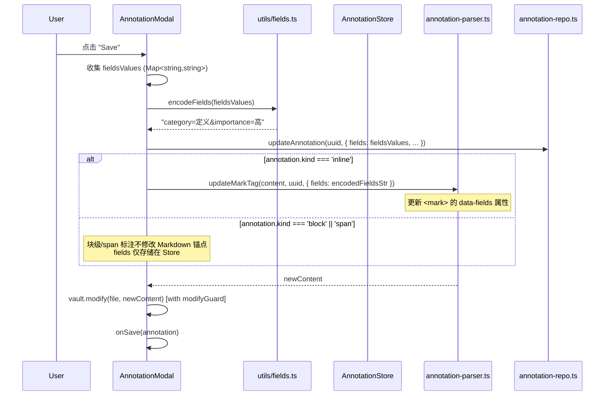
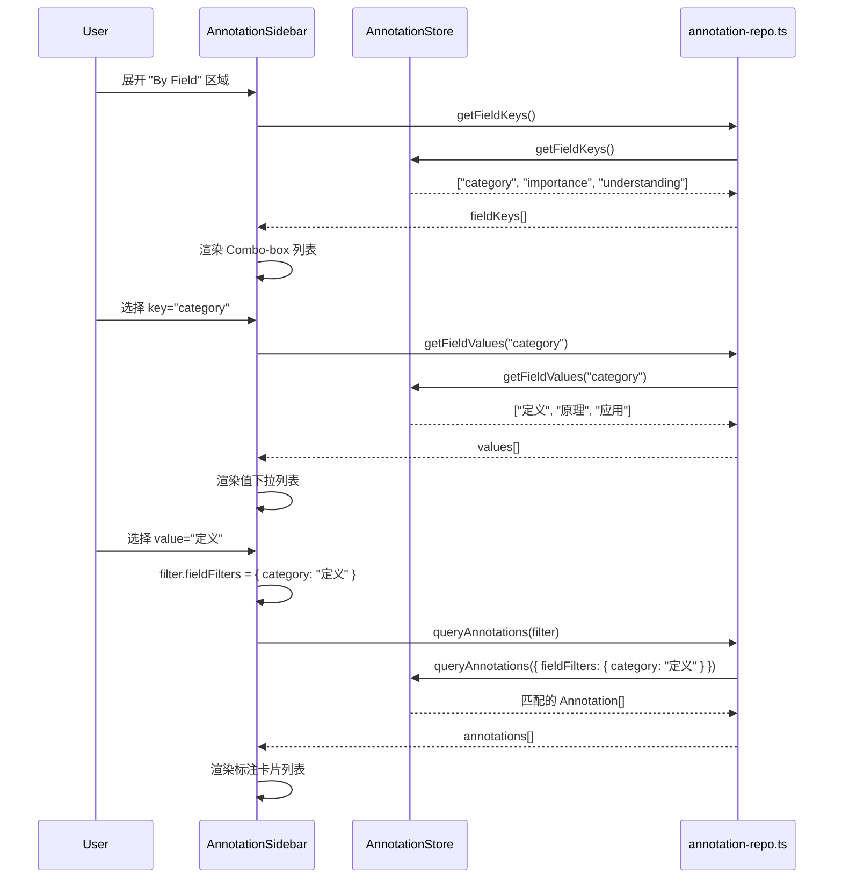
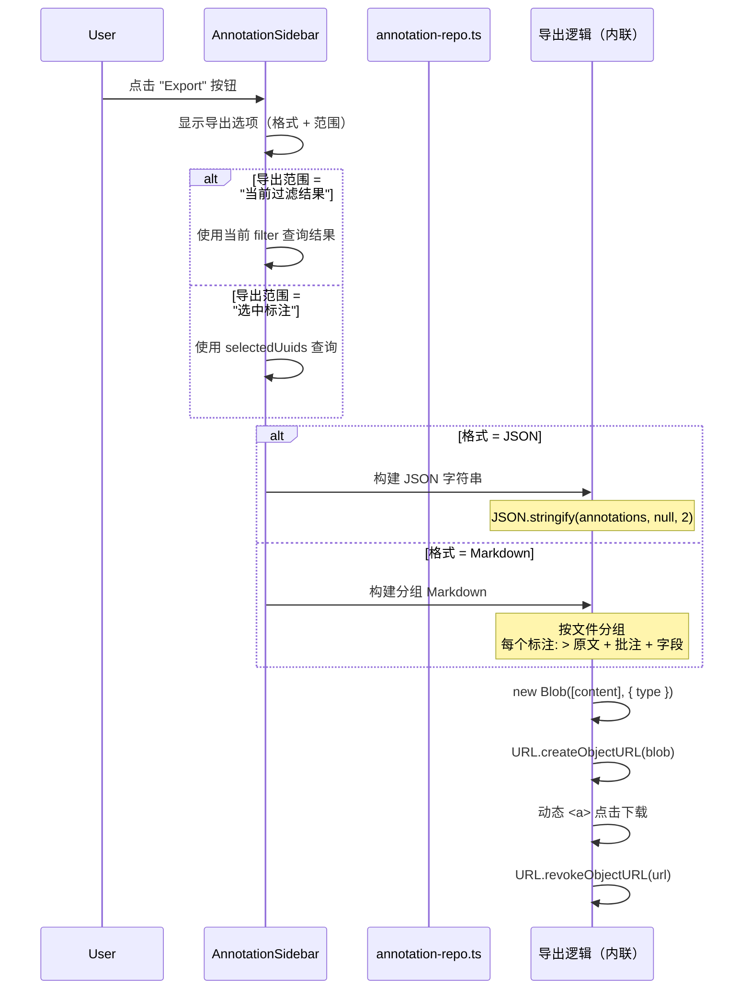
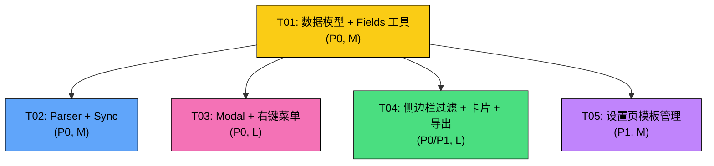

# MarkVault Phase 3 — 系统架构设计 + 任务分解

> 架构师：高见远（Gao） | 版本：v1.0 | 日期：2025-07-10

---

## 1. 实现方案 + 框架选型

### 1.1 核心技术挑战

| 挑战 | 分析 | 方案 |
|------|------|------|
| Fields 编解码 | `<mark>` 的 `data-fields` 属性需要可靠的双向序列化 | URL 编码风格 `key1=val1&key2=val2`，使用 `encodeURIComponent`/`decodeURIComponent`，与现有 `escapeAttr` 配合 |
| 行内 vs 块级 fields 存储 | 行内标注 fields 存于 `<mark>` 属性 + Store；块级/span 仅存于 Store | 根据 `annotation.kind` 分流，`buildMarkTag` 写入 `data-fields`，`buildBlockAnchor`/`buildSpanAnchor` 不写入 fields |
| Combo-box 字段过滤 UI | 需要同时支持下拉建议和自由输入 | 使用 Obsidian 的 `SearchComponent` 或自建轻量 Combo-box（input + dropdown list），数据源来自 Store 的 `getFieldKeys`/`getFieldValues` |
| 模板系统 | 需要在 Settings 和 Modal 之间共享模板数据 | 模板存储在 `MarkVaultSettings.fieldTemplates`，通过 `plugin.settings` 统一管理 |
| 导出功能 | 侧边栏批量操作区新增按钮，下载文件 | 使用 `Blob` + `URL.createObjectURL` + 动态 `<a>` 点击，纯前端实现，无需后端 |
| syncFromMarkdown fields 同步 | 从 `data-fields` 解析回 Annotation.fields | 在 `parseMarkAttributes` 中提取 `data-fields` 属性，调用 `decodeFields()` 解码 |

### 1.2 框架/库选型

| 用途 | 选型 | 理由 |
|------|------|------|
| UI 组件 | Obsidian 原生 Setting API + 自建 HTML | 与 Phase 1/2 保持一致，不引入外部 UI 框架 |
| 字段序列化 | 自实现 `encodeFields`/`decodeFields` | 格式简单，无需第三方库 |
| 导出下载 | 浏览器原生 `Blob` + `URL.createObjectURL` | 零依赖，已在 Phase 2 的 `exportAnnotations` 中使用 |
| 模板数据 | `MarkVaultSettings.fieldTemplates` | Obsidian 插件 settings 标准模式 |

### 1.3 架构模式

延续 Phase 1/2 的分层架构：
- **数据层**: `types/annotation.ts`（模型）+ `db/annotation-store.ts`（存储引擎）+ `db/annotation-repo.ts`（代理层）
- **核心层**: `core/annotation-parser.ts`（编解码）+ `core/markdown-sync.ts`（同步引擎）
- **UI 层**: `ui/editor/`（Modal + 右键菜单）+ `ui/sidebar/`（侧边栏）+ `ui/settings/`（设置页）
- **工具层**: `utils/fields.ts`（新增，fields 编解码工具）

---

## 2. 文件列表及相对路径

### 2.1 新增文件

| 文件路径 | 说明 |
|----------|------|
| `src/utils/fields.ts` | Fields 编解码工具（`encodeFields`/`decodeFields`/`applyTemplate`/`DEFAULT_FIELD_TEMPLATES`）|

### 2.2 修改文件

| 文件路径 | 修改内容概述 |
|----------|-------------|
| `src/types/annotation.ts` | 1) 新增 `FieldTemplate`/`FieldDef` 接口 2) `MarkAttributes` 新增 `fields?` 属性 3) `MarkVaultSettings` 新增 `fieldTemplates`/`defaultTemplateId` 4) `DEFAULT_SETTINGS` 增加默认模板 5) `AnnotationStats` 新增 `withFields` |
| `src/db/annotation-store.ts` | 新增 `getFieldKeys()`/`getFieldValues(key)` 方法 |
| `src/db/annotation-repo.ts` | 新增 `getFieldKeys()`/`getFieldValues(key)` 代理函数 |
| `src/core/annotation-parser.ts` | 1) `buildMarkTag` 写入 `data-fields` 属性 2) `parseMarkAttributes` 解析 `data-fields` 3) `updateMarkTag` 支持 fields 更新 4) `parseMarkVaultAnnotations` 解析 fields 回 Annotation |
| `src/core/markdown-sync.ts` | `syncFromMarkdown` 中同步 fields（MD→DB） |
| `src/ui/editor/annotation-modal.ts` | 1) 新增 Fields 编辑区 UI 2) 保存时写入 fields 3) 模板应用下拉菜单 |
| `src/ui/editor/context-menu.ts` | 新增 "Annotate with field" 子菜单项 |
| `src/ui/sidebar/AnnotationSidebar.ts` | 1) 过滤栏新增 "By Field" 区域 2) 标注卡片展示 fields 标签 3) 批量模式新增导出按钮 |
| `src/ui/settings/settings-tab.ts` | 新增字段模板管理 UI（查看/编辑/新建/删除/恢复默认）|
| `src/main.ts` | 1) `loadSettings` 合并默认模板 2) `exportAnnotations` 增强（支持 Markdown/JSON/按过滤导出）|

---

## 3. 数据结构和接口

### 3.1 新增类型定义

```typescript
// ── src/types/annotation.ts ──

/** 字段定义（模板中的单个字段） */
export interface FieldDef {
  key: string;           // 字段键名，如 "category"
  values: string[];      // 预设值列表，如 ["定义", "原理", "应用"]
  allowCustom?: boolean; // 是否允许自由输入（默认 true）
}

/** 字段模板 */
export interface FieldTemplate {
  id: string;           // 模板唯一 ID（UUID）
  name: string;         // 模板名称，如 "学术标注"
  fields: FieldDef[];   // 字段定义列表
}
```

### 3.2 MarkAttributes 扩展

```typescript
// 修改 src/types/annotation.ts 中的 MarkAttributes

export interface MarkAttributes {
  uuid: string;
  type: AnnotationType;
  color: string;
  note?: string;
  tags?: string;
  groupUuid?: string;
  fields?: string;  // 🆕 URL 编码的 fields 字符串，如 "category=定义&importance=高"
}
```

### 3.3 AnnotationFilter 扩展（已有，无需修改）

```typescript
// 已有 fieldFilters 字段，无需变更
export interface AnnotationFilter {
  type?: AnnotationType | 'all';
  color?: string | 'all';
  hasNote?: boolean;
  searchQuery?: string;
  fieldFilters?: Record<string, string>;  // ✅ 已存在
  sortBy?: 'position' | 'createdAt' | 'updatedAt';
}
```

### 3.4 MarkVaultSettings 扩展

```typescript
// 修改 src/types/annotation.ts 中的 MarkVaultSettings

export interface MarkVaultSettings {
  presetColors: typeof PRESET_COLORS;
  defaultHighlightColor: PresetColorId;
  defaultAnnotationType: AnnotationType;
  showContextMenu: boolean;
  sidebarDefaultSort: 'position' | 'createdAt' | 'updatedAt';
  contextWindowSize: number;
  enableAutoSync: boolean;
  // 🆕 Phase 3
  fieldTemplates: FieldTemplate[];         // 字段模板列表
  defaultTemplateId: string;              // 默认模板 ID（空字符串表示无默认模板）
}
```

### 3.5 DEFAULT_SETTINGS 扩展

```typescript
export const DEFAULT_SETTINGS: MarkVaultSettings = {
  // ... 现有字段 ...
  fieldTemplates: [
    {
      id: 'academic',
      name: '学术标注',
      fields: [
        { key: 'category', values: ['定义', '定理', '证明', '推论', '应用'], allowCustom: true },
        { key: 'importance', values: ['高', '中', '低'], allowCustom: false },
        { key: 'understanding', values: ['已掌握', '部分理解', '未理解'], allowCustom: false },
      ],
    },
    {
      id: 'reading',
      name: '阅读笔记',
      fields: [
        { key: 'type', values: ['核心论点', '支撑论据', '反驳', '疑问', '灵感'], allowCustom: true },
        { key: 'action', values: ['待复查', '待实践', '待讨论'], allowCustom: true },
      ],
    },
  ],
  defaultTemplateId: '',
};
```

### 3.6 AnnotationStore 新增方法签名

```typescript
// src/db/annotation-store.ts 新增方法

class AnnotationStore {
  // ... 现有方法 ...

  /**
   * 获取所有已加载标注中出现过的字段键名列表
   * 遍历 _byField 索引的 key 集合
   * @returns 去重排序后的字段键名数组
   */
  getFieldKeys(): string[] {
    return Array.from(this._byField.keys()).sort();
  }

  /**
   * 获取指定字段键的所有已出现值列表
   * @param key 字段键名
   * @returns 去重排序后的字段值数组
   */
  getFieldValues(key: string): string[] {
    const fieldMap = this._byField.get(key);
    if (!fieldMap) return [];
    return Array.from(fieldMap.keys()).sort();
  }
}
```

### 3.7 Fields 编解码工具

```typescript
// src/utils/fields.ts

/**
 * 将 Record<string, string> 编码为 URL 查询字符串格式
 * 例: { category: "定义", importance: "高" } → "category=定义&importance=高"
 */
export function encodeFields(fields: Record<string, string>): string {
  return Object.entries(fields)
    .map(([k, v]) => `${encodeURIComponent(k)}=${encodeURIComponent(v)}`)
    .join('&');
}

/**
 * 将 URL 查询字符串格式解码为 Record<string, string>
 * 例: "category=定义&importance=高" → { category: "定义", importance: "高" }
 * 空字符串返回空对象
 */
export function decodeFields(raw: string): Record<string, string> {
  if (!raw || !raw.trim()) return {};
  const result: Record<string, string> = {};
  for (const pair of raw.split('&')) {
    const eqIdx = pair.indexOf('=');
    if (eqIdx === -1) continue;
    const key = decodeURIComponent(pair.substring(0, eqIdx));
    const value = decodeURIComponent(pair.substring(eqIdx + 1));
    result[key] = value;
  }
  return result;
}

/**
 * 将模板应用到标注的 fields（合并策略：保留已有的同键值，填充模板中缺失的键）
 */
export function applyTemplate(
  template: FieldTemplate,
  existingFields?: Record<string, string>,
): Record<string, string> {
  const fields: Record<string, string> = { ...existingFields };
  for (const fieldDef of template.fields) {
    if (!(fieldDef.key in fields) && fieldDef.values.length > 0) {
      // 仅当该键不存在时，填入第一个预设值
      fields[fieldDef.key] = fieldDef.values[0];
    }
  }
  return fields;
}
```

---

## 4. 程序调用流程

### 4.1 Modal 保存 Fields 的时序图



### 4.2 侧边栏字段过滤的调用流程



### 4.3 导出功能的调用流程



---

## 5. 任务列表

### T01: 项目基础设施 + 数据模型 + Fields 工具

**优先级**: P0 | **工作量**: M | **依赖**: 无

**修改文件**:
- `src/types/annotation.ts` — 新增 `FieldTemplate`/`FieldDef` 接口；`MarkAttributes` 新增 `fields?: string`；`MarkVaultSettings` 新增 `fieldTemplates`/`defaultTemplateId`；`DEFAULT_SETTINGS` 增加默认模板；`AnnotationStats` 新增 `withFields`
- `src/utils/fields.ts` — 新建文件，实现 `encodeFields`/`decodeFields`/`applyTemplate`
- `src/db/annotation-store.ts` — 新增 `getFieldKeys()`/`getFieldValues(key)` 方法
- `src/db/annotation-repo.ts` — 新增 `getFieldKeys()`/`getFieldValues(key)` 代理函数

**详细说明**:
1. 在 `annotation.ts` 中定义 `FieldTemplate` 和 `FieldDef` 接口
2. 扩展 `MarkAttributes` 添加 `fields?: string`
3. 扩展 `MarkVaultSettings` 添加 `fieldTemplates: FieldTemplate[]` 和 `defaultTemplateId: string`
4. 在 `DEFAULT_SETTINGS` 中硬编码「学术标注」和「阅读笔记」两个内置模板
5. 新建 `utils/fields.ts`，实现 fields 的编解码工具函数
6. 在 `AnnotationStore` 上实现 `getFieldKeys()` 和 `getFieldValues(key)`，直接读取 `_byField` 索引
7. 在 `annotation-repo.ts` 中添加对应的代理函数

---

### T02: 核心层 — Parser Fields 支持和 Sync 增强

**优先级**: P0 | **工作量**: M | **依赖**: T01

**修改文件**:
- `src/core/annotation-parser.ts` — `buildMarkTag` 写入 `data-fields`；`parseMarkAttributes` 解析 `data-fields` → `fields`；`updateMarkTag` 支持 fields 更新；`parseMarkVaultAnnotations` 解析 fields 回填到 Annotation
- `src/core/markdown-sync.ts` — `syncFromMarkdown` 中同步 fields（MD→DB 更新逻辑）

**详细说明**:
1. `buildMarkTag()`: 如果 `annotation.fields` 存在且非空，调用 `encodeFields()` 生成 `data-fields="category=定义&importance=高"` 属性
2. `parseMarkAttributes()`: 识别 `data-fields` 属性，调用 `decodeFields()` 解码为 `Record<string, string>`
3. `parseMarkVaultAnnotations()`: 将解析出的 fields 赋值到 Annotation 对象的 `fields` 属性
4. `updateMarkTag()`: 新增 fields 更新逻辑：
   - `updates.fields` 存在时，编码为 `data-fields` 属性
   - `updates.fields` 为空对象 `{}` 时，移除 `data-fields` 属性
5. `syncFromMarkdown()`: 在第 3 步（两边都有→更新）中，增加 fields 的同步逻辑：
   - MD 有 fields 且 DB 无 → 更新 DB
   - MD 有 fields 且 DB 有但不同 → 以 MD 为准
   - MD 无 fields 且 DB 有 → 保留 DB（防止行内标注被意外清除 fields）

---

### T03: Modal Fields 编辑 UI + 右键菜单快速字段标注

**优先级**: P0 | **工作量**: L | **依赖**: T01

**修改文件**:
- `src/ui/editor/annotation-modal.ts` — 新增 Fields 编辑区；模板应用下拉菜单；保存逻辑写入 fields
- `src/ui/editor/context-menu.ts` — 新增 "Annotate with field" 子菜单
- `src/main.ts` — `loadSettings` 合并默认模板（升级兼容）

**详细说明**:

**AnnotationModal 变更**:
1. 新增实例变量 `fieldsValue: Record<string, string>`，初始化自 `annotation.fields || {}`
2. 在 Tags 编辑区下方新增 Fields 编辑区：
   - 标题 "Fields"
   - 动态行列表：每行 = key 输入框 + value 输入框 + 删除按钮
   - "Add Field" 按钮：添加空行
   - "Apply Template" 下拉菜单：列出 `plugin.settings.fieldTemplates`，选择后 `applyTemplate()` 合并
3. `save()` 方法变更：
   - 收集 `fieldsValue`（过滤空键）
   - 写入 `updates.fields = this.fieldsValue`
   - 对 inline 标注：调用 `updateMarkTag(content, uuid, { fields: encodedFieldsStr })`
   - 对 block/span 标注：仅更新 Store，不修改 Markdown

**ContextMenu 变更**:
1. 在 "Annotate + Note" 菜单项后，新增 "🏷️ Annotate with field" 菜单项
2. 检查 `plugin.settings.defaultTemplateId` 是否有值
3. 如果有默认模板，获取模板的 `FieldDef[]`，生成扁平菜单项：
   - 每个字段每个值一个菜单项：`  category: 定义`
4. 点击后创建标注并自动设置 fields 值

**main.ts 变更**:
1. `loadSettings()`: 合并时确保 `fieldTemplates` 和 `defaultTemplateId` 存在（升级兼容旧配置）

---

### T04: 侧边栏 — 字段过滤面板 + 卡片 Fields 展示 + 导出

**优先级**: P0/P1 | **工作量**: L | **依赖**: T01

**修改文件**:
- `src/ui/sidebar/AnnotationSidebar.ts` — 1) 过滤栏新增 "By Field" 区域 2) 标注卡片展示 fields 3) 批量模式新增导出按钮 4) 导出逻辑实现
- `src/main.ts` — `exportAnnotations()` 增强，或移入 Sidebar 内联

**详细说明**:

**过滤栏 "By Field" 区域**:
1. 在排序栏下方新增 "By Field" 区域
2. 第一个 Combo-box：选择字段键（`getFieldKeys()` 提供选项 + 自由输入）
3. 选择键后，显示第二个 Combo-box：选择字段值（`getFieldValues(key)` 提供选项 + 自由输入）
4. 选择值后，更新 `filter.fieldFilters = { [key]: value }`
5. 清除按钮：移除 fieldFilter 条目
6. 支持多个字段过滤条件（数组或 Map 存储）

**标注卡片 Fields 展示**:
1. 在 tags 下方新增 fields 展示区
2. 每个字段渲染为 `key:value` 标签样式（`.markvault-field-tag`）
3. 字段标签点击 → 快速添加到当前过滤条件
4. 超过 3 个字段时折叠，显示 "N more..." 可展开

**导出功能**:
1. 批量操作栏新增 "📥 Export" 按钮
2. 点击后显示 Menu 选择：
   - 格式：Markdown / JSON
   - 范围：当前过滤结果 / 选中标注
3. JSON 格式：`JSON.stringify(annotations, null, 2)`
4. Markdown 格式：按文件分组，每个标注格式：
   ```markdown
   ## 文件名.md

   > 标注原文

   **批注**: 批注内容
   **字段**: category=定义, importance=高
   **标签**: #tag1 #tag2

   ---
   ```
5. 使用 `Blob` + `URL.createObjectURL` 下载

---

### T05: 设置页 — 字段模板管理

**优先级**: P1 | **工作量**: M | **依赖**: T01

**修改文件**:
- `src/ui/settings/settings-tab.ts` — 新增字段模板管理 UI
- `src/main.ts` — 无额外变更（已在 T03 处理 loadSettings）

**详细说明**:

1. 在 "Data Management" 区域之前新增 "Field Templates" 区域
2. 展示现有模板列表（名称 + 字段数量）
3. 每个模板可展开编辑：
   - 模板名称输入框
   - 字段列表：每行 = 字段键 + 预设值(逗号分隔) + 是否允许自定义(开关) + 删除按钮
   - "Add Field" 按钮
4. "New Template" 按钮：创建空模板
5. "Restore Default Templates" 按钮：将 `DEFAULT_SETTINGS.fieldTemplates` 覆盖回 `plugin.settings.fieldTemplates`
6. 默认模板选择下拉框：设置 `defaultTemplateId`
7. 所有变更即时保存 `plugin.saveSettings()`

---

## 6. 共享知识

### 6.1 Fields 编解码规则

```
编码方向: Record<string, string> → string
  - 使用 encodeURIComponent 对 key 和 value 分别编码
  - 用 & 连接各对
  - 例: { "category": "定义", "importance": "高" } → "category=%E5%AE%9A%E4%B9%89&importance=%E9%AB%98"
  - 在 <mark> 属性中还会经过 escapeAttr() 进行 HTML 转义

解码方向: string → Record<string, string>
  - 先经过 decodeHTMLEntities()（在 parseMarkAttributes 中统一处理）
  - 用 & 分割，= 分割键值
  - 使用 decodeURIComponent 解码
  - 空字符串 → {}
  - 容错：跳过无效格式（无 = 的段）
```

### 6.2 Fields 存储策略

| 标注类型 | Markdown 存储 | AnnotationStore 存储 | 说明 |
|----------|--------------|---------------------|------|
| `inline` (kind=undefined/'inline') | `<mark data-fields="...">` | `annotation.fields` | 双写，可从 MD 恢复 |
| `block` | ❌ 不存储 | `annotation.fields` | 仅 Store，锚点格式不携带 |
| `span` | ❌ 不存储 | `annotation.fields` | 仅 Store，数据量不可控 |

### 6.3 UI 组件复用策略

- **Combo-box**: 使用 Obsidian 的 `<input>` + 自建下拉列表（`<div>` 绝对定位），不依赖第三方组件
- **字段标签样式**: 复用 `.markvault-tag` 样式，增加 `.markvault-field-tag` 变体（浅色背景 + 等宽字体键名）
- **模板下拉**: 使用 Obsidian `Setting.addDropdown()` 或 `Menu` API
- **导出菜单**: 使用 Obsidian `Menu` API（与批量改色菜单一致）

### 6.4 字段过滤 API 使用

```typescript
// 已有 API，无需修改
const results = annotationStore.queryAnnotations({
  fieldFilters: { category: '定义', importance: '高' }
});
// 多字段条件为 AND 关系
```

### 6.5 设置升级兼容

```typescript
// loadSettings 中使用 Object.assign 合并，确保新增字段有默认值
this.settings = Object.assign({}, DEFAULT_SETTINGS, data);
// 即使旧 data 中没有 fieldTemplates，DEFAULT_SETTINGS 中的默认值会生效
```

---

## 7. 待明确事项

1. **字段过滤的交互细节**: 当用户选择多个字段过滤条件时，是否需要支持"OR"关系？当前 `queryAnnotations` 的 `fieldFilters` 是 AND 关系。**假设**: Phase 3 仅支持 AND 关系。

2. **右键菜单 "Annotate with field" 的默认模板来源**: PRD 说"展示默认模板的字段选项"。如果用户未设置默认模板，该菜单项不显示。**假设**: 从 `plugin.settings.defaultTemplateId` 获取模板；如果为空字符串则不显示该菜单项。

3. **导出文件名格式**: **假设**: `markvault-export-YYYY-MM-DD.json` / `markvault-export-YYYY-MM-DD.md`，与现有 `exportAnnotations` 一致。

4. **卡片 fields 折叠数量**: PRD 说超过 3 个折叠。**假设**: 显示前 3 个，剩余折叠在 "N more..." 中。

5. **模板字段值的编辑方式**: Settings 页面中预设值使用逗号分隔的文本输入框。**假设**: 简单文本输入，解析时按逗号分割并 trim。

---

## 8. 任务依赖图



> **关键路径**: T01 → T02（核心层 fields 读写链路打通）
> **并行开发**: T03/T04/T05 均仅依赖 T01，可并行开发
